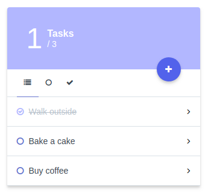

# Simple Task List

Laravel + Vue + TailwindCSS

<p align="center">



</p>

### Requirements

- Composer
- Node
- NPM

### Installation

This project use Laravel 5.6 as Framework, to run it see the packages needed [here](https://laravel.com/docs/5.6/#server-requirements)

1 - Clone the project

```bash
$ git clone git@github.com:LucasLeandro1204/simple-tasklist.git tasklist
$ cd tasklist
```

2 - Create a .env file

```bash
$ cp .env.example .env
```

_SQLITE is the default provider_

3 - Install everything and run production

```bash
$ composer install
$ npm install
$ npm run prod
```

Now you can go to tasklist.test/ and BOOM working =)

### Testing

This projects has unit / feature tests, simple run phpunit
```bash
$ vendor/bin/phpunit tests/
```
